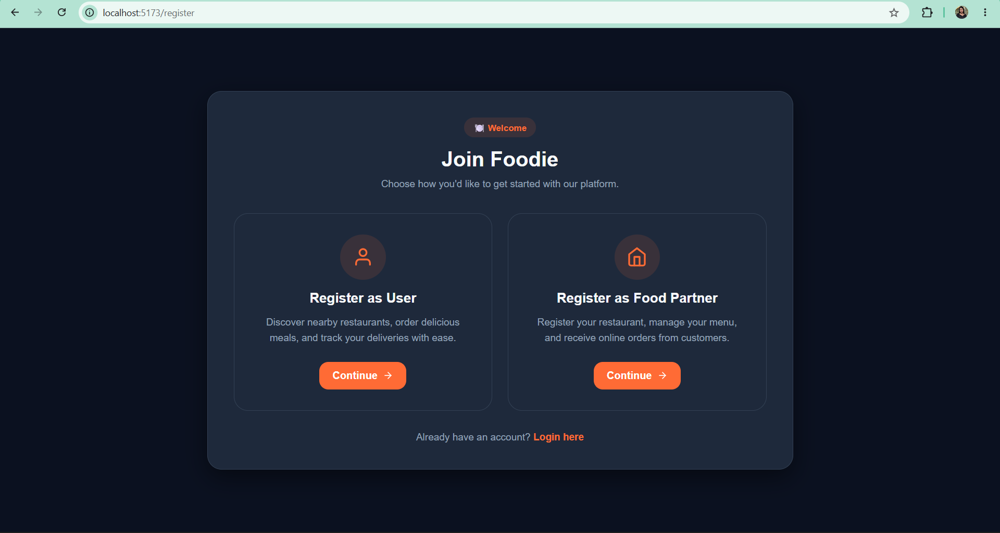
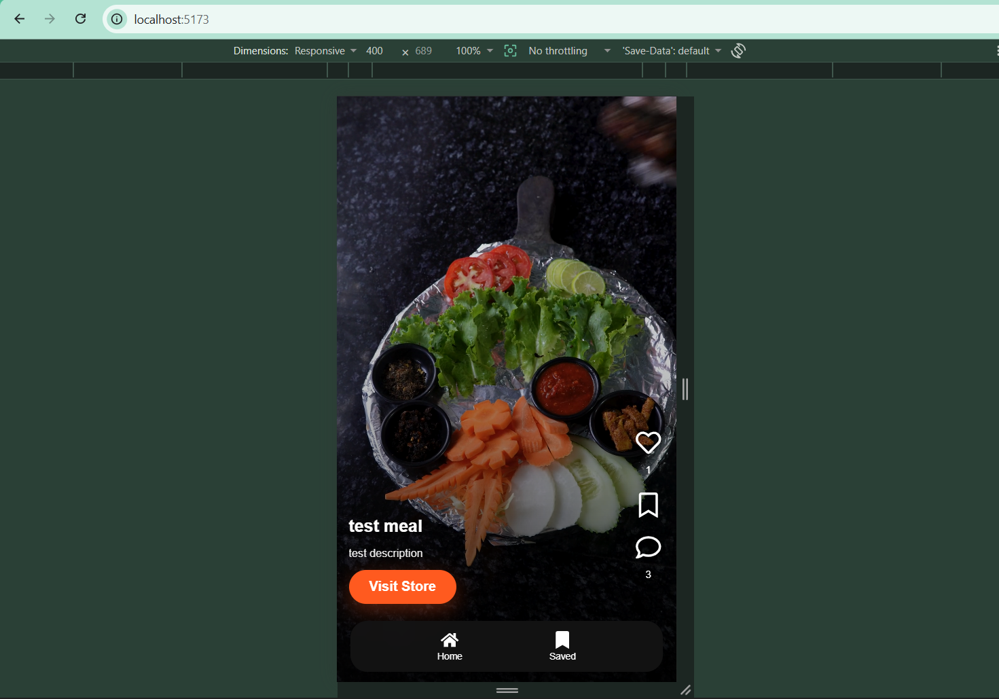
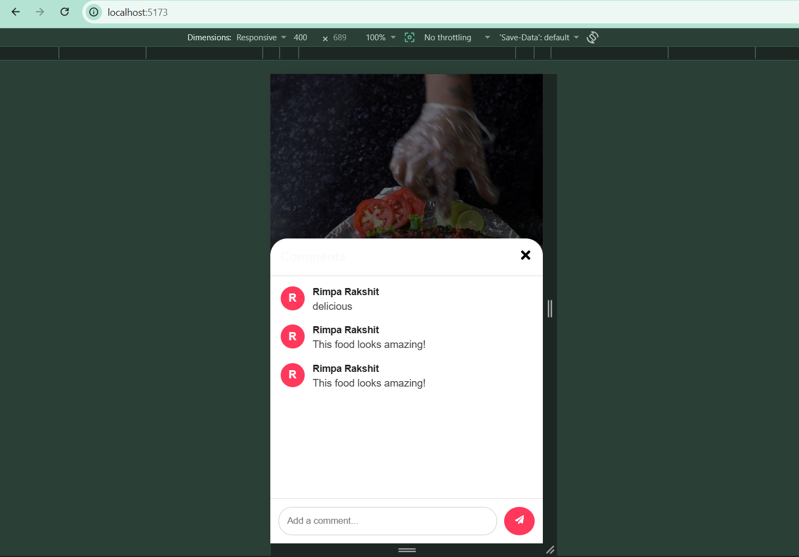
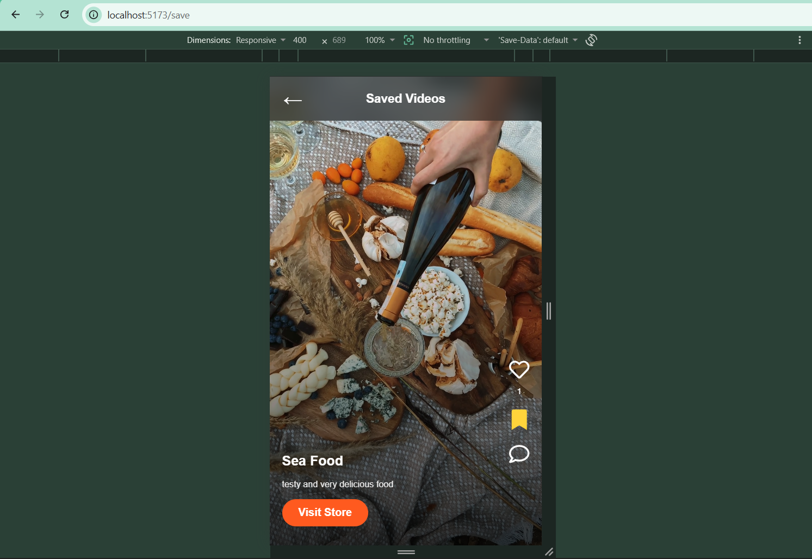
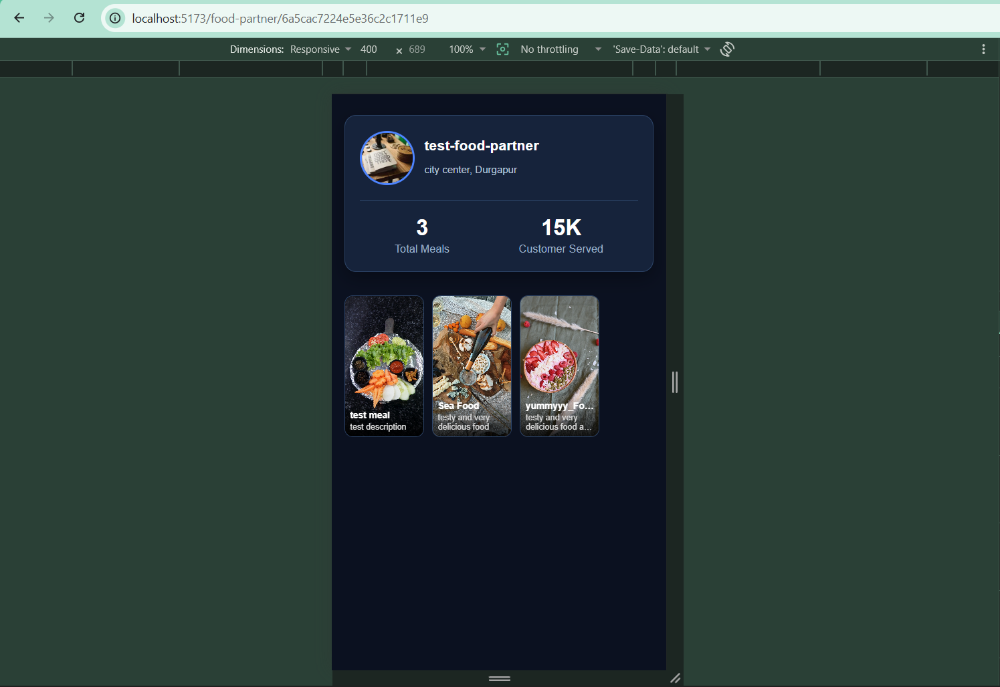

# 🍽️ BiteShare – MERN Food Sharing Platform

A full-stack MERN food sharing platform where users can discover, share, and interact with food videos through a modern reels-style interface.

## 🚀 Features

- 🔐 User & Food Partner Authentication
- 🎥 Reels-style Food Video Feed
- ❤️ Like & Unlike Videos
- 💬 Comment System
- 🔖 Save/Bookmark Videos
- 🏪 Food Partner Profile
- 📤 Upload Food Videos
- ☁️ ImageKit Integration for Media Storage
- 📱 Responsive UI

## 🛠️ Tech Stack

### Frontend
- React.js
- CSS
- Axios
- React Router
- React Icons

### Backend
- Node.js
- Express.js
- MongoDB
- Mongoose
- JWT Authentication
- Multer
- ImageKit

## 📸 Project Screenshots

### 🔐 Registration Page | 🎥 Reels Feed
<p align="center">
  
  
</p>

*Left: User registration page. Right: Reels-style food feed with like, comment, save, and profile navigation.*

---

### 💬 Comment Section | 🔖 Saved Videos
<p align="center">
  
  
</p>

*Left: Interactive comment section. Right: Saved videos page for bookmarked food content.*

---

### 🏪 Food Partner Profile
<p align="center">
  
</p>

*Food partner profile showcasing uploaded food videos.*

## 📂 Project Structure

```text
BiteShare-mern-food-sharing-platform
│
├── assets
│   └── screenshots
├── backend
├── frontend
└── README.md
```

## ⚙️ Installation

### Clone the repository

```bash
git clone https://github.com/MonalishaRakshit/BiteShare-mern-food-sharing-platform.git
```

### Backend Setup

```bash
cd backend
npm install
```

Create a `.env` file and add:

```env
PORT=3000
MONGODB_URI=your_mongodb_connection_string
JWT_SECRET=your_jwt_secret
IMAGEKIT_PUBLIC_KEY=your_public_key
IMAGEKIT_PRIVATE_KEY=your_private_key
IMAGEKIT_URL_ENDPOINT=your_url_endpoint
CLIENT_URL=http://localhost:5173
```

Run the backend:

```bash
npm run dev
```

### Frontend Setup

```bash
cd frontend
npm install
npm run dev
```

## 🎯 Future Improvements

- Notifications
- Search & Filters
- Follow System
- User Profiles
- Real-time Chat
- Admin Dashboard

## 👩‍💻 Author

**Monalisha Rakshit**

GitHub: https://github.com/MonalishaRakshit

---
